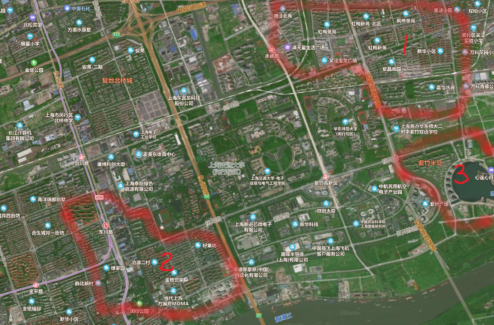
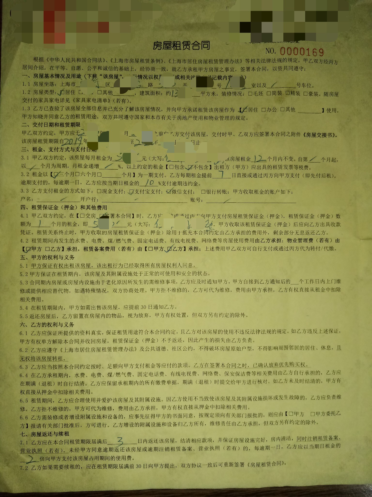
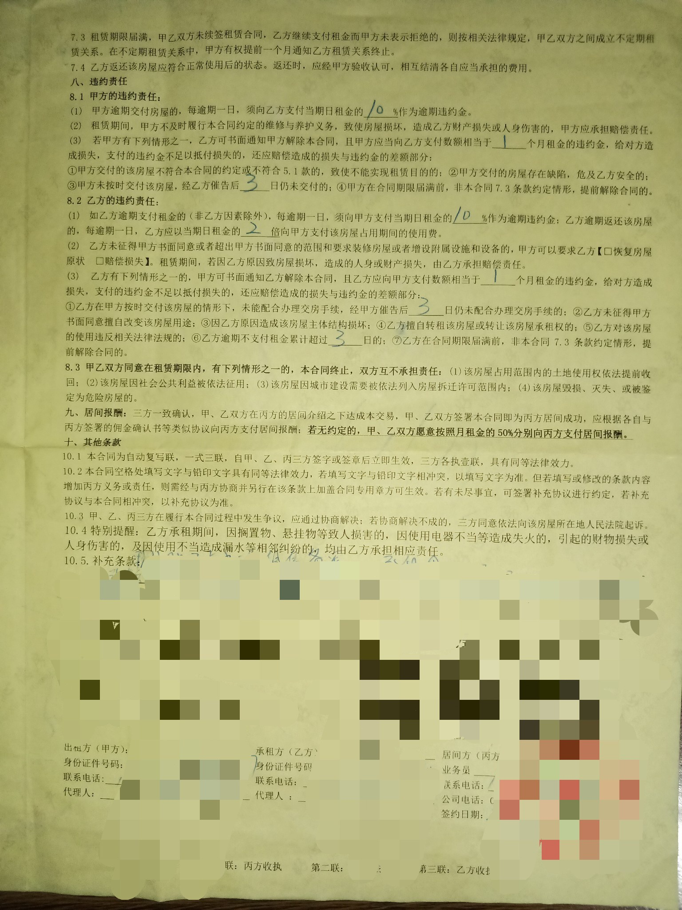

本站访问量次

## 写在入门之前
首先特别感谢组内同事提供的初稿，以及租房群第一代成员提供的宝贵信息，希望这些信息能帮助到大家。

一些说明：

这篇文章主要针对首次在上海闵行紫竹地区租房的同学，如果你已经是老司机，后续内容可能帮助有限。

文章将力求描述准确，但我们信息收集能力有限，内容可能过时，最终还是应以官方政策和实际情况为准。

房租年年上涨，情况月月不同，这些信息最后更新于**2021.6**。

## 区域与房源

在这章里将会介绍紫竹的租房区域和典型小区优劣，

租房有两大主流区域：

1. 吴泾地区，在华师大东北方向。

* **万乐城**

    在公司附近的商业公寓，适合喜欢独居的小伙伴，可在公寓底楼房管获取租房信息。
    
    优点：一居室独立空间，不用合租；楼下是商业广场，生活便利；距离地铁15号线永德路2分钟路程，方便去市区浪。

    缺点：商用水电比民用贵，房租略贵。物业会指定宽带，会贵。商业小区不能开**居住证/落户**的材料。

* **虹梅新苑/枫华景苑/紫晶南园/万科花园小城/xx苑**

    吴泾地区的普通商品房和回迁房。

    优点：房龄比较新，如果是精装房，居住体验好。

    缺点：离地铁有一些距离，紫竹地区公交班次也比较少，总之交通不太方便。一居室相对少，得找人合租。

2. 老闵行地区，在交大西南方向。

* **东苑佳和园/源枫景苑/万国府**

    距离交大一条街的3个新小区。

    优点：电梯房，有门禁，小区比较新。

    缺点：一室一厅的户型都改成二室，更适合合租。

* **沧源小区/京浦花园/三明花园/北欧丽景/交大新村**

    交大对面的小区群。

    优点：交通方便，房租相对便宜，晚上可以坐加班车直达交大，交大对面路上有很多饭店，北欧丽景有双朝南的户型。

    缺点：小区略老，6层楼无电梯，楼底没有门，高楼层（5，6楼）冬季用水高峰期会水压不足。

* **金榜人家/凤凰城**

    优点：地铁便利，方便出去浪。在班车点旁边，可以免费蹭车。欧尚大超市旁边，生活娱乐丰富。

    缺点：房型较大，房租略贵，房源紧俏。

还有一个相对独立的土豪区：

3. 紫竹半岛，这附近唯一的豪宅，打工人奋斗的目标。

* **紫竹半岛**

    优点：距离公司很近，走路15分钟可以到公司；小区环境是紫竹地区最好的。

    缺点：周围没有卖场，缺少生活气息；房租贵。

说说房租，决定房租的因素很多，因房而异。一般装修好，楼层好，小区安静，交通方便的房子总是会贵一些，下面给一些基本参考：

**一房**在2000-4000，万乐城的单间会比较便宜，朝北~2000，朝南~2500；正规的一室一厅~3500。

**两房**在3500-5000，感觉又上了一个台阶，把一室一厅改成两室的两房会略便宜，大概要3500-4000，正规的两室一厅大概在4000-5000。

**三房**在5000-6500，同理两室一厅改成的三房会便宜，正规的三室两厅贵一些。

**紫竹半岛的一室一厅**在4500-6000

## 租房的方案

如果想要一个人住的可能方案，

1. 找自如租一个房间，相对方便不用自己找室友，但室友不可控，遇到问题自如管家不一定真的会协调。

2. 去万乐城租一个单间，独立空间比较自由。万乐城是商用水电，比民用水电贵，找房渠道有楼下的链家，好心德中介，听说楼里面也有个房管，各自都有不同的房源。

3. 在附近小区里租一个一房，在吴泾的虹梅新苑，紫晶南园，万科花园小城和老闵行的沧源小区中“隐藏”少量一房。一般除了房间还有一个客厅，会大一些，这个一般就直接找中介问。

如果大家凑够了人数合租，附近的沧源小区，交大新村，金榜世家，紫晶南园，虹梅新苑，枫桦景苑都是比较常见的选择。

## 发现的问题

1. 目前周围有很多二房东，就是从原房东手里租房然后转租赚钱的人，与他们签约要谨慎，闵行地区已经出现过二房东诈骗跑路的案例，尽量不要一次性付一年的租金，必要的时候可以要求复印一份二房东与原房东的合同。

2. 会有一些一个人出来做生意的个体中介，只收一个月房租35%的中介费（有门店的中介一般收50%，不过链家近期好像又不收房客中介费了），尽可能多做了解谨慎签约。

3. 沿主干道的房间晚上会比较吵，比如沪闵路，虹梅南路，之前也听到同事说东苑佳和园和紫晶南园中的几幢楼离在建的新楼近，有噪音的问题。

4. 放一个合同的例子给大家参考，关于最后打码的补充条款，其实所有和房东协商好的内容都应该写上，比如协助办居住证，家具家电更换等等。签约的时候原则上要看房东的房产证，身份证，这个和交钱的账户要对起来，如果不一致要说明原因，必要时加到补充条款里。

